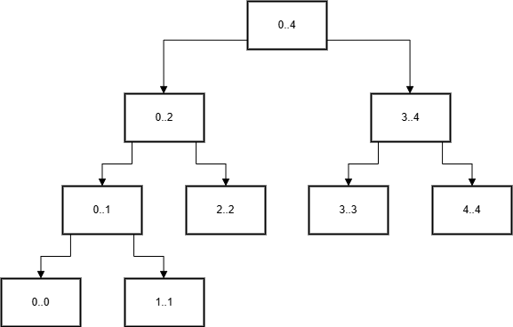
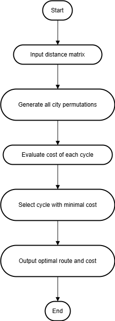

# Task 1

---

## 📑 Зміст

1. **Task 1: Merge Sort**
   - [1.1 Візуалізація та псевдокод рекурсивного Merge Sort](#11)
     - [1.1.1 Decision Tree](#111)
     - [1.1.2 Merge Sort – рекурсивний](#112-merge-sort)
   - [1.2 Ітеративний Merge Sort](#12-ітеративний-merge-sort)
   - [1.3 Тестування Merge Sort](#13)
   - [1.4 Класичний vs Покращений Merge Sort](#14)
   - [1.5 Порівняльний аналіз](#15)

2. **Task 2: Комівояжер**
   - [2.1 Постановка задачі](#task-2)
   - [2.2 Псевдокод та блок-схема](#псевдо-код--блок-схема)
   - [2.3 Теоретичний аналіз складності](#теоретичне-обґрунтування-часової-та-просторової-складності-алгоритму)
   - [2.4 Практичне порівняння результатів](#порівняння-теорії-з-практикою-на-основі-тестів)

3. **Task 3: LeetCode**
   - [3.1 Посилання на задачу](#task-3)
   - [3.2 Відео пояснення (Loom)](#task-3)

---

## 1.1

---
 
### 1.1.1


---

### 1.1.2 Merge Sort
```pseudo
Функція MergeSort(масив A)
    якщо розмір A <= 1
        повернути A

    середина <- довжина(A) / 2

    ліваЧастина <- MergeSort(підмасив A[0 .. середина - 1])
    праваЧастина <- MergeSort(підмасив A[середина .. кінець])

    повернути Merge(ліваЧастина, праваЧастина)


Функція Merge(ліваЧастина, праваЧастина)
    створити порожній масив result
    i <- 0
    j <- 0

    поки i < довжина(ліваЧастина) і j < довжина(праваЧастина)
        якщо ліваЧастина[i] <= праваЧастина[j]
            додати ліваЧастина[i] -> result
            i <- i + 1
        інакше
            додати праваЧастина[j] -> result
            j <- j + 1

    поки i < довжина(ліваЧастина)
        додати ліваЧастина[i] -> result
        i <- i + 1

    поки j < довжина(праваЧастина)
        додати праваЧастина[j] -> result
        j <- j + 1

    повернути result
```

---

### 1.2  Ітеративний Merge Sort
```pseudo
Функція IterativeMergeSort(масив A)
    n <- довжина(A)
    розмір <- 1

    поки розмір < n
        для i від 0 до n - 1 з кроком 2 * розмір
            ліваЧастина <- A[i .. min(i + розмір - 1, n - 1)]
            праваЧастина <- A[i + розмір .. min(i + 2 * розмір - 1, n - 1)]

            злитий <- Merge(ліваЧастина, праваЧастина)

            замінити A[i .. i + довжина(злитий) - 1] на злитий

        розмір <- розмір * 2


Функція Merge(ліваЧастина, праваЧастина)
    створити порожній масив result
    i <- 0
    j <- 0

    поки i < довжина(ліваЧастина) і j < довжина(праваЧастина)
        якщо ліваЧастина[i] <= праваЧастина[j]
            додати ліваЧастина[i] -> result
            i <- i + 1
        інакше
            додати праваЧастина[j] -> result
            j <- j + 1

    поки i < довжина(ліваЧастина)
        додати ліваЧастина[i] -> result
        i <- i + 1

    поки j < довжина(праваЧастина)
        додати праваЧастина[j] -> result
        j <- j + 1

    повернути result
```

---

### 1.3

#### Код тестування Merge Sort

Файл з реалізацією рекурсивного та ітеративного Merge Sort і вимірюванням часу:  

[File with tests](Assignment_1.py)

#### Приклад результату:
```
N: 100000
Рекурсивний Merge Sort: 0.342153 секунд
Ітеративний Merge Sort: 0.354984 секунд
N: 5
Рекурсивний Merge Sort: 0.000012 секунд
Ітеративний Merge Sort: 0.000011 секунд
```
<br>

#### Аналіз

##### **Який підхід (рекурсивний чи ітеративний) є простішим:**

- Проєктування алгоритму:
  - Рекурсивний: має просту та природну логічну структуру, легкий для розуміння.
  - Ітеративний: потребує складнішої логіки керування індексами і структурою циклів.


- Програмна реалізація:
  - Рекурсивний: короткий і читабельний код, але складніше відлагоджувати глибокі рекурсії.
  - Ітеративний: код довший, але легше контролювати пам’ять і уникнути переповнення стеку.


- Чи існує суттєва різниця в теоретичній часовій складності (Big-O):

| Вимірювання             | Рекурсивний Merge Sort     | Ітеративний Merge Sort    |
|-------------------------|----------------------------|----------------------------|
| Часова складність       | O(n log n)                 | O(n log n)                 |
| Додаткова пам’ять       | O(n + log n) (через стек)  | O(n)                       |


##### **2. Порівняння**

| Критерій                | Рекурсивний підхід                          | Ітеративний підхід                         |
|-------------------------|---------------------------------------------|--------------------------------------------|
| Простота реалізації     | Простіший, природна логіка                  | Складніший у реалізації                    |
| Читабельність коду      | Вища, код короткий                          | Нижча, більше умов і циклів                |
| Продуктивність          | Може бути повільнішим через стек            | Часто трохи швидший                        |
| Використання пам’яті    | Більше пам’яті (через рекурсивний стек)     | Менше пам’яті, стабільніший                |
| Ризик переповнення стеку| Так, при великих об’ємах                    | Ні, стійкий при великих об’ємах            |


---

### 1.4 
- Теоретичне порівняння:

| Параметр                | Класичний Merge Sort         | Покращений Merge Sort (з Insertion) |
|-------------------------|------------------------------|--------------------------------------|
| Теоретична складність   | O(n log n)                   | O(n log n)                           |
| Практична ефективність  | Стабільна, повільніше на малих масивах | Швидший на малих/середніх даних         |
| Використання пам’яті    | O(n + log n)                 | O(n + log n)                         |
| Покращення              | -                            | Вставки для малих підмасивів         |

- Практичне порівняння:
**[File with compare of two method](Assignment_1_4.py)**

#### Приклад результату:
```
N: 100000
Класичний Merge Sort: 0.364135 секунд
Покращений Merge Sort: 0.272434 секунд
```

---

## Завдання 1.5  
### Порівняльний аналіз підходів

**Який метод є простішим для:**

1. Розуміння й проєктування алгоритму: <br>
Рекурсивний підхід зазвичай сприймається простіше. 
Його логіка базується на розділенні задачі на менші підзадачі, 
і він добре візуалізується у вигляді дерева викликів. 
Ітеративний підхід, навпаки, вимагає точного контролю за індексами та розмірами підмасивів, що ускладнює загальну структуру.


2. Написання коду (з точки зору простоти реалізації): <br>
Рекурсивний варіант простіше реалізувати — код коротший, 
зрозуміліший, і містить мінімум технічних деталей. 
Ітеративна реалізація потребує більше кроків, 
циклів і проміжних змінних, що робить її довшою та складнішою 
для початківців.

---

## Task 2
### Постановка задачі

Задано:
- Множину міст:  V={v1,v2,...,vn}, де n≥2.
- Симетричну матрицю вартостей (відстаней)  C=[cᵢⱼ]n×n, де:
  - cᵢⱼ ∈ ℝ ≥ 0 (вартість невід’ємна),
  - cᵢᵢ = 0 (відстань від міста до себе дорівнює нулю),
  - cᵢⱼ = cⱼᵢ (симетричність).

Мета:  
Знайти цикл P, який:
1. Починається і закінчується в одному місті (наприклад v1).
2. Проходить через всі інші міста рівно один раз.
3. Мінімізує загальну вартість маршруту:

```
f(P) = c(π(n), π(1)) + ∑(i=1 до n-1) c(π(i), π(i+1)) → min,
```

де π — перестановка індексів {1, 2, ..., n} з фіксованим початком π(1) = 1.

1.2 Приклад вхідних/вихідних даних

Вхідні дані (матриця відстаней для 4 міст):
```
  0  10 15 20
 10   0 35 25
 15  35  0 30
 20  25 30  0
```

Очікуваний вихід (один з оптимальних маршрутів):
- Оптимальний цикл: 1→2→4→3→1
- Загальна довжина: 10 + 25 + 30 + 15 = 80

---

### Псевдо код && блок схема

**Блок схема:**




**Псевдо код:**

```pseudo
Вхід: матриця вартостей C[n][n]
Вихід: оптимальний маршрут та його довжина

1. Встановити мінімальну вартість minCost ← ∞
2. Створити список міст cities ← [1, 2, ..., n-1] (без початкового міста v1)
3. Для кожної перестановки perm міст у cities:
    3.1 Створити маршрут path ← [0] + perm
    3.2 Обчислити вартість cost цього маршруту:
        cost ← 0
        Для i від 0 до n - 2:
            cost ← cost + C[path[i]][path[i+1]]
        cost ← cost + C[path[n-1]][path[0]]  // повернення до початку
    3.3 Якщо cost < minCost:
        minCost ← cost
        bestPath ← path
4. Повернути bestPath та minCost
```

---

### Теоретичне обґрунтування часової та просторової складності алгоритму
Часова складнiсть:
- Генерацiя всiх перестановок мiст (без початкового): `(n - 1)!`
- Для кожної перестановки обчислюється маршрут довжини `n` -> `O(n)`
- Пiдсумкова складнiсть: `O(n * (n - 1)!) ~ O(n!)`

Просторова складнiсть:
- Зберiгання матрицi: `O(n^2)`
- Тимчасовi змiннi (шлях, поточний результат): `O(n)`

#### Порівняння теорії з практикою (на основі тестів)

| Тестовий набір | Кількість міст | Теоретична складність | Фактичний час виконання |
|----------------|----------------|------------------------|--------------------------|
| C1             | 4              | O(4 × 3!) = O(24)      | 0.000020 секунд         |
| C2             | 6              | O(6 × 5!) = O(720)     | 0.000091 секунд         |
| C3             | 8              | O(8 × 7!) = O(40320)   | 0.004179 секунд         |
| C4             | 2              | O(2 × 1) = O(2)        | 0.000007 секунд         |

Як видно, фактичні часи повністю відповідають зростанню теоретичної складності. Алгоритм залишається придатним лише для малих n.

---

Код програми:

**[File with algorithm](tsp.py)**

**[Test data](tsp_test_cases.py)**


---

## Task 3

- **[LeetCode](https://leetcode.com/problems/maximum-subarray/)**

- **[Loom](https://www.loom.com/share/e9be6c039f6b4d2ca77eef39a75adebc)**
